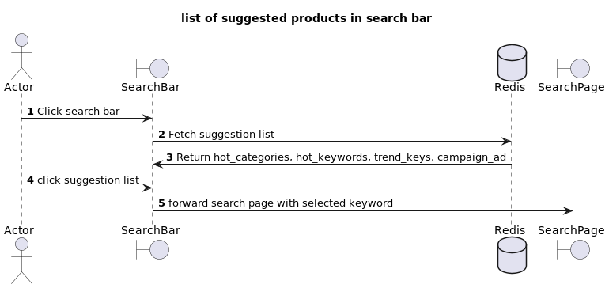
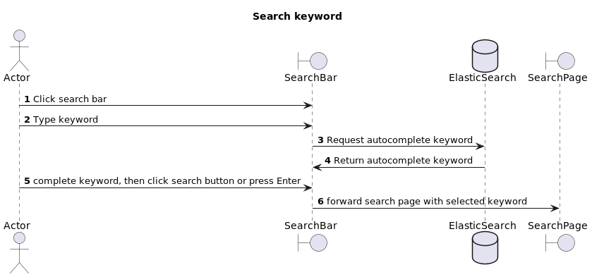
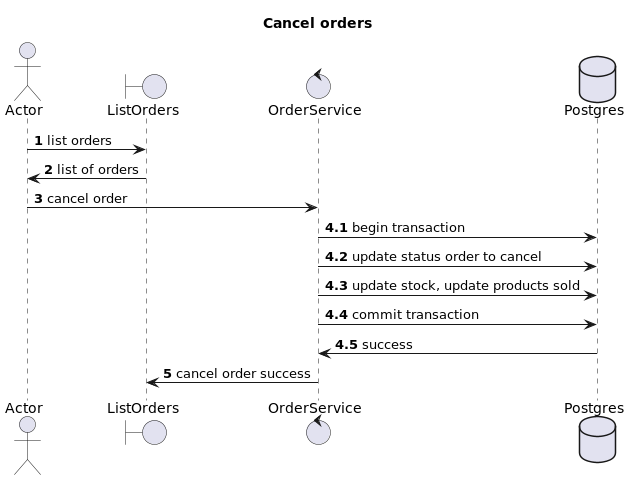
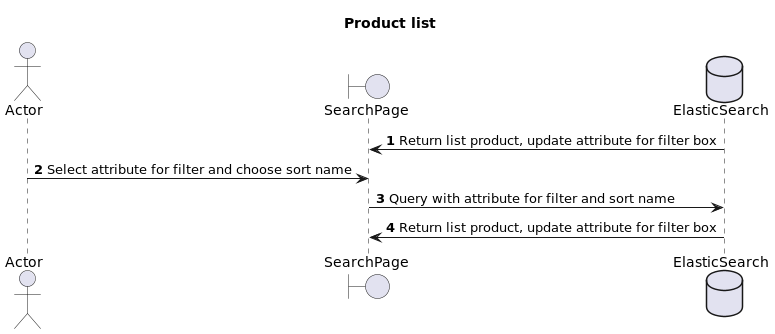

# Analyze, design, and apply multiple database types to application: Tiki E-commerce Site
[![CC BY-SA 4.0][cc-by-sa-shield]][cc-by-sa]

## I. Introduction

This is final project in our Advanced Database course, focusing on the comprehensive analysis, design, and application of multiple database types within the context of an e-commerce site. Our aim was to understand and implement various database SQL and NoSQL databases handle diverse data needs effectively.

## II. Objectives

- To analyze the data requirements of an e-commerce platform and identify suitable database types for different data needs.
- To design and integrate SQL and NoSQL databases to support the functionality of an e-commerce site.
- To apply database concepts to real-world applications, emphasizing performance, scalability, and data integrity.
- To demonstrate the ability of multiple databases to work cohesively within a single application environment.

## III. System architecture

Briefly describe the overall architecture of your e-commerce site. Include a diagram if possible to illustrate how the different components and databases interact with each other.

### Relational Database

- **Purpose**: core database managing relational data such as users, products, orders, etc.
- **Technology Used**: PostgresSQL
- **Schema Design**: Provide a brief overview or diagram of the schema.

### NoSQL databases

#### Cache Database
- **Purpose**: caching frequently accessed data
- **Technology Used**: Redis
- **Schema Design**: Provide a brief overview or diagram of the schema.

#### Search Engine
- **Purpose**: autocomplete search and search products by keyword
- **Technology Used**: Elasticsearch
- **Schema Design**: Provide a brief overview or diagram of the schema.

## Features

- **Feature 1**: list of suggested products in search bar


- **Feature 2**: search keyword


- **Feature 3,4**: List of orders and cancel order


- **Feature 5**: Filter and sort products list


## Setup and Installation

### Requirements
- python 3.10
- Docker
- Docker Compose

```shell
cd k33-ad-final-project/

# Install dependencies
pip install -r requirements.txt

# Load data into PostgreSQL
# gen_data/CSDLNC_DATH_DDL_Updated.sql
# gen_data/CSDLNC_DATH_SAMPLE.sql

# Load data into Redis
PYTHONPATH=./backend python gen_data/cache_gen.py

# Load data into ES
PYTHONPATH=./backend python gen_data/es_gen.py

# Start docker compose 
docker-compose up -d

# Shutdown docker compose
docker-compose down
```


## Contributors

List the team members:
- Phan Kiến Thức
- Phạm Ngọc Thùy Trang
- Phạm Vũ Duy

## Acknowledgments

- [PostgreSQL](https://www.postgresql.org/)
- [Redis](https://redis.io/)
- [Elasticsearch](https://www.elastic.co/)
- [Docker](https://www.docker.com/)
- [FastAPI](https://fastapi.tiangolo.com/)
- [Vertabelo](https://www.vertabelo.com/)


## License

This work is licensed under a
[Creative Commons Attribution-ShareAlike 4.0 International License][cc-by-sa].

[![CC BY-SA 4.0][cc-by-sa-image]][cc-by-sa]

[cc-by-sa]: http://creativecommons.org/licenses/by-sa/4.0/
[cc-by-sa-image]: https://licensebuttons.net/l/by-sa/4.0/88x31.png
[cc-by-sa-shield]: https://img.shields.io/badge/License-CC%20BY--SA%204.0-lightgrey.svg